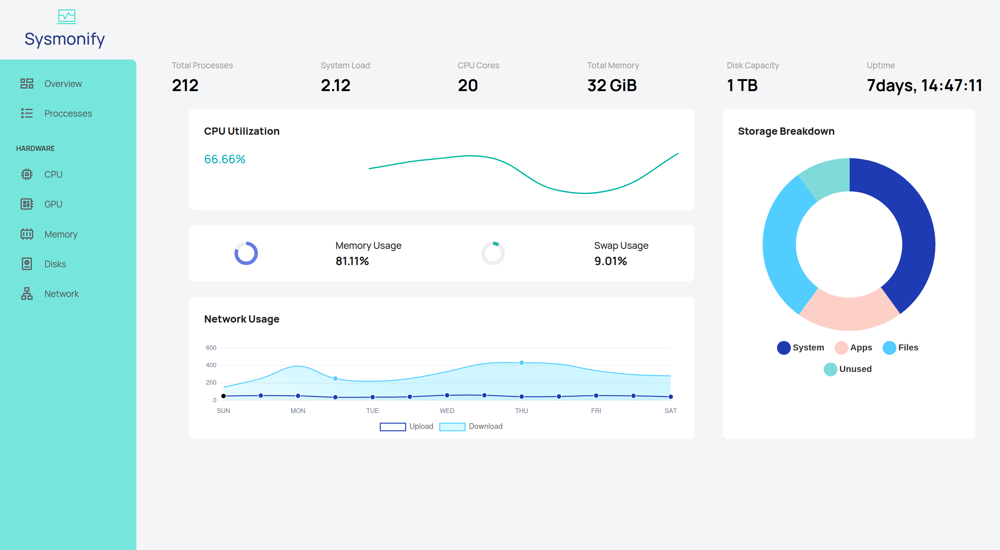

# Sysmonify

[](https://codecov.io/gh/k3y5tr0k3/sysmonify)



**Real-time system resource monitoring for Linux Desktops.**
Sysmonify provides live updates on CPU, memory, disk, and network usage through a Django backend, WebSocket updates, and a responsive web interface.

<br><br>

## 🚀 Features
- **Real-time monitoring** of key system resources.
- **WebSocket updates** for instant UI refresh.
- **Lightweight web UI** built with vanilla JS and Bootstrap.
- **Cross-component stack**: Django + Daphne (ASGI).
- **Planned integrations** for Gnome desktop overlays.

<br><br>

## 🛠 Development Setup

### 1. Create virtual environment

```bash
python3 -m venv venv
```

### 2. Activate virtual environment

```bash
source ./venv/bin/activate
```

### 3. Install Dependencies

```bash
pip install -r dev-requirements.txt
```

### 4. Set up GitHub pre-commit hooks

```bash
pre-commit install
```

### 5. Collect Static files

```bash
cd sysmonify && python3 manage.py collectstatic
```

### 6. Run development sever

```bash
daphne -b 0.0.0.0 -p 8000 sysmonify.asgi:application
```

<br><br>

## 🧪 Testing

### 1. Create virtual environment

```bash
python3 -m venv venv
```

### 2. Activate virtual environment

```bash
source ./venv/bin/activate
```

### 3. Install Dependencies

```bash
pip install -r dev-requirements.txt
```

### 4. Run unit tests

```bash
cd sysmonify && pytest
```

<br><br>

## 🗺 Project Roadmap

| Version | Release Date | Details |
|---------|--------------|---------|
| 0.0.1-alpha | 30-08-2025 | Initial Release: <br> &nbsp;&nbsp; - Django backend. <br> &nbsp;&nbsp; - Basic monitoring functionality for all major system resources. <br> &nbsp;&nbsp; - Websockets for updating UI in real-time. <br> &nbsp;&nbsp; - Web frontend (vanilla JS and Bootstrap). <br> &nbsp;&nbsp; - Base CI/CD for automated testing.
| 0.0.2-alpha | 30-09-2025 | Improved reliability and performance of existing functionality.
| 0.1.0-beta | 31-10-2025 | Additional Features: <br> &nbsp;&nbsp; - User Settings (SQLite). <br> &nbsp;&nbsp; - UI Light/Dark modes <br> &nbsp;&nbsp; - General visual improvements to UI
| 0.2.0-beta | 30-11-2025 | Gnome overlay
| 1.0.0 | 31-01-2026 | Additional Features: <br> &nbsp;&nbsp; - View Additional Process Details <br> &nbsp;&nbsp; - Terminate/Kill Process(s) <br> &nbsp;&nbsp; - View Additional Network Connection Details <br> &nbsp;&nbsp; - Terminate/Kill network connections.

---

<br><br>

## 📜 License

[MIT License](LICENSE)


## 🤝 Contributing

Pull requests are welcome! Please open an issue first to discuss proposed changes.


## 📬 Contact

For questions or suggestions, please open a GitHub issue.
